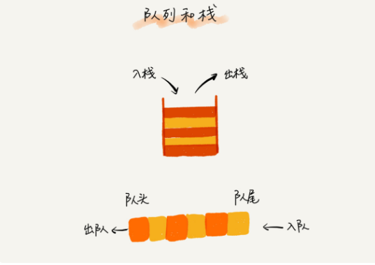

我们知道，CPU 资源是有限的，任务的处理速度与线程个数并不是线性正相关。相反，过多的线程反而会导致 CPU 频繁切换，处理性能下降。所以，线程池的大小一般都是综合考虑要处理任务的特点和硬件环境，来事先设置的。

当我们向固定大小的线程池中请求一个线程时，如果线程池中没有空闲资源了，这个时候线程池如何处理这个请求？是拒绝请求还是排队请求？各种处理策略又是怎么实现的呢？

实际上，这些问题并不复杂，其底层的数据结构就是我们今天要学的内容，队列（queue）。

### 如何理解“队列”？

队列这个概念非常好理解。你可以把它想象成排队买票，先来的先买，后来的人只能站末尾，不允许插队。先进者先出，这就是典型的 **“队列”**。

我们知道，栈只支持两个基本操作： **入栈 push()和出栈 pop()**。队列跟栈非常相似，支持的操作也很有限，最基本的操作也是两个：入队 enqueue()，放一个数据到队列尾部；出队 dequeue()，从队列头部取一个元素。



所以，队列跟栈一样，也是一种操作受限的线性表数据结构。

队列的概念很好理解，基本操作也很容易掌握。作为一种非常基础的数据结构，队列的应用也非常广泛，特别是一些具有某些额外特性的队列，比如循环队列、阻塞队列、并发队列。

它们在很多偏底层系统、框架、中间件的开发中，起着关键性的作用。比如高性能队列 Disruptor、Linux 环形缓存，都用到了循环并发队列；

Java concurrent 并发包利用 ArrayBlockingQueue 来实现公平锁等。顺序队列和链式队列我们知道了，队列跟栈一样，也是一种抽象的数据结构。

它具有先进先出的特性，支持在队尾插入元素，在队头删除元素，那究竟该如何实现一个队列呢？跟栈一样，队列可以用数组来实现，也可以用链表来实现。用数组实现的栈叫作顺序栈，用链表实现的栈叫作链式栈。

同样，用数组实现的队列叫作顺序队列，用链表实现的队列叫作链式队列。我们先来看下基于数组的实现方法。


```python
from typing import Optional

class ArrayQueue:
    
    def __init__(self, capacity: int):
        self._items = []
        self._capacity = capacity
        self._head = 0
        self._tail = 0

    def enqueue(self, item: str) -> bool:
        if self._tail == self._capacity:
            if self._head == 0:
                return False
            else:
                for i in range(0, self._tail - self._head):
                    self._items[i] = self._items[i + self._head]
                self._tail = self._tail - self._head
                self._head = 0
        
        self._items.insert(self._tail, item)
        self._tail += 1
        return True
    
    def dequeue(self) -> Optional[str]:
        if self._head != self._tail:
            item = self._items[self._head]
            self._head += 1
            return item
        else:
            return None
```

以上就是基于数组实现的队列，从代码上来看，入队操作是不是有点麻烦，并且难懂？  

队列的顺序存储结构需要使用一个数组和两个整数型变量来实现， 利用数组顺序存储队列中的所有元素，利用两个整数变量分别存储队首元素和队尾元素的下标位置，分别称为队首指针和队尾指针。

队列元素的出列是在队头，即下标为0的位置，那也就意味着，队列中的所有元素都得向前移动，以保证队列的队头（也就是下标为0的位置）不为空，此时的时间复杂度为0(n)。

可有时想想，为什么出队列时一定要全部移动呢，如果不去限制队列的元素必须存储在数组的前n个单元这一条件，出队的性能就会大大增加。也就是说，队头不需要一定在下标为0的位置，比如也可以是a[1]等。

而为了避免当只有一个元素时，队头和队尾重合使处理变得麻烦，引入两个指针，front指针指向队头元素，rear指针指向队尾元素的下一个位置，这样当front等于rear时，此队列不是还剩一个元素，而是空队列。

对于队列最好的方法是使用链表实现，因为对于数组来说，队列可能会出现下面这种情况：

假设是长度为5的数组，初始状态，空队列如所示，front与 rear指针均指向下标为0的位置。然后入队a1、a2、a3、a4, front指针依然指向下标为0位置，而rear指针指向下标为4的位置。


 
出队a1、a2，则front指针指向下标为2的位置，rear不变，如下图所示，再入队a5，此时front指针不变，rear指针移动到数组之外。嗯？数组之外，那将是哪里？


 
问题还不止于此。假设这个队列的总个数不超过5个，但目前如果接着入队的话，因数组末尾元素已经占用，再向后加，就会产生数组越界的错误，
可实际上，我们的队列在下标为0和1的地方还是空闲的。我们把这种现象叫做“假溢出”。

不可以继续添加元素，否则会造成数组越界而遭致程序出错。然而此时又不应该扩充数组，因为还有大量实际空间未被占用。